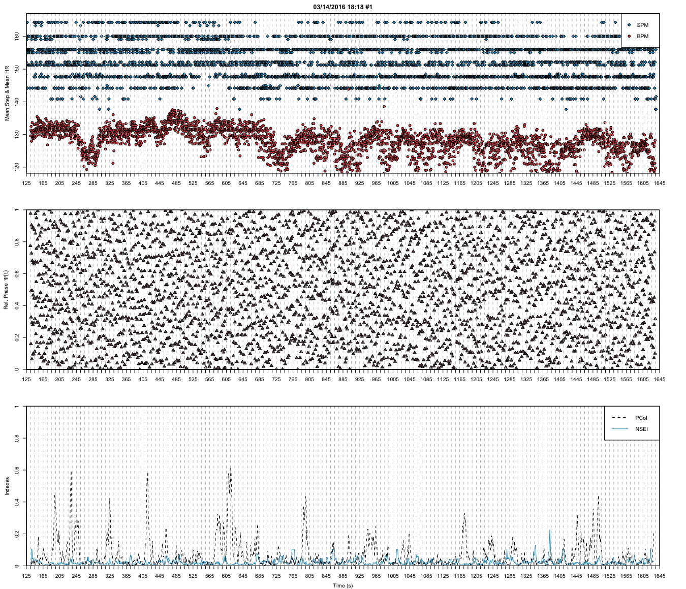

# Summary

Flow is widely understood as a source of creativity and innovation, physical and mental peak performances, and wellbeing. Individuals who experience flow tend to find the activity enjoyable and intrinsically rewarding [@Csikszentmihalyi2005]. In the research project “Flow-Machines: Body Movement and Sound” (2012-2015) funded by German Federal Ministry of Education and Research (BMBF) we addressed how flow while walking can be supported by means of mobile technology. Using the rewarding effect of flow on the future motivation to walk, Flow-Machines should help to change the sedentary lifestyle.

Our research activities are organized in three interconnected strands a) process-oriented modeling of walking, b) searching for implicit indices of flow while walking and running and c) supporting (flow-) experiences while walking [@Hajinejad2013]). Within the second strand, we searched for candidates for an implicit measurement method of flow-experience while walking and running.

Flow research is mainly based on explicit indices of flow extracted from interview or questionnaires. Future applications have to rely on implicit indices that allow us to design novel experiences and studying dimensions of embodied interaction. An implicit flow measurement measures flow-experiences without distraction the ongoing activity by a second or parallel activity.

In this paper, we present PsychoPhysioPipeline [@Bogutzky2016b], a pipeline of several small R programs for segmenting the collected data of the PsychoPhysioCollector [@Bogutzky2016a], for identifying potential implicit flow characteristics and for their analysis. The pipeline allows researchers to correlate physiological, kinematical and subjective variables, as well as to analyze fluctuations over time. The pipeline supports the calculation of explicit flow dimensions based on the Flow-Short-Scale [@Rheinberg2003] and the calculation of the jerk-cost [@Hreljac2000] and the cardiolocomotor phase synchronization [@Niizeki2014] as potential implicit flow characteristics. The pipeline uses the free HRV software Kubios HRV [@Tarvainen2014] to compute RR intervals from ECG data and calculate HRV parameters. 

The pilot deployment was successfully used in the research project Flow-Machines ("Flow-Machines: Body Movement and Sound", 2012-2015) at the University of Applied Sciences Bremen and funded by German Federal Ministry of Education and Research (BMBF; Förderkennzeichen: 03FH084PX2). Figure 1 shows for example the cardiolocomotor phase synchronization of a participant with low flow-experience in our running study.

# References