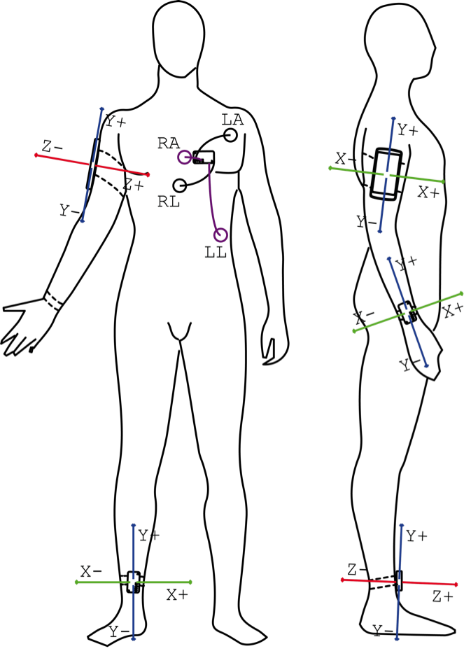

# Ziel
Die Studie diente dazu statistische Beziehungen zwischen:

* Flow und der Aktivität des autonomen Nervensystems
* Flow und dem Bewegungsfluss

beim Laufen herzustellen. Des Weiteren suchte ich in den Daten nach markanten Mustern, die den Eintritt in den Flow, Flow selbst und den Austritt aus dem Flow markieren.

# Methode 
## Untersuchungsdesign 

Ein männlicher Freizeitläufer (29) nahm am Experiment teil. Er lief in sechs aufeinanderfolgenden Wochen an einem Tag 60 Minuten jeweils die gleiche Strecke und zur gleichen Tageszeit.

Vor jedem Lauf rüstete ich ihn mit einem geladenen Smartphone, einem passenden Smartphone-Armband, zwei geladenen Bewegungssensoren, einem geladenen Elektrokardiogramm (EKG)-Sensoren und vier Elektroden aus. Die Anordnung des Equipments ist Abbildung 1 zu entnehmen.



Abbildung 1: Anordnung des Equipments

Während jedes Laufes nutzte ich die dafür eigens entwickelte mobile Datenaufnahme App, um EKG und Bewegungsdaten mit Hilfe der tragbaren Sensoren des Unternehmens Shimmer Research (Shimmer 2r) aufzuzeichnen. Die Datenaufnahme App läuft auf dem Android OS ab Version 4.4 und kommuniziert mit den Sensoren über Bluetooth. Die Bewegungssensoren besitzen einen Beschleunigungsmesser und ein Kreiselinstrument, die beide auf jeweils drei Achsen messen. Für das Experiment nutzte ich das Smartphone Samsung Galaxy Nexus, welches auch über einen Beschleunigungsmesser und ein Kreiselinstrument verfügt. Alle Bewegungssensoren arbeiten mit einer Datenrate von 100 Hz. Der EKG-Sensor von Shimmer Research arbeitet mit vier Ableitungen. Im Experiment nutzte ich Knopfelektroden und eine Datenrate von 204.8 Hz. Alle 15 Minuten während jedes Laufes forderte die Datenaufnahme App mit einem Signal den Läufer auf, eine FSK auszufüllen. Vor jedem Lauf führte der Läufer eine 15-minütige Baseline Messung durch. 

Nach jedem Lauf übertrug ich die gesammelten Daten für die software-technische Analyse auf meinen Arbeitsrechner. Die Daten bestehen für jeden Lauf aus kontinuierlichen EKG-Daten, Global Positioning System (GPS)-Positionen, Beschleunigungen und Winkelgeschwindigkeiten von den Körperpositionen Bein, Arm und Handgelenk. 

## Flow-Diagnostik
### Datenverarbeitung

#### Flow-Kurzskala

Zur subjektiven Erfassung des Flow-Erlebens kam die Flow-Kurzskala (FKS) von **Rheinberg, Vollmeyer und Engeser (2003)** zum Einsatz. Die FKS besteht aus insgesamt 16 Items. Die ersten 10 Items bilden anhand einer 7-Punkte-Likert-Skala ("trifft nicht zu" = 1 bis "trifft zu" = 7) Komponenten des Flow-Erlebens ab und man fasst sie als Generalfaktor zusammen. Zur weiteren Differenzierung des Flow-Konstrukts ist der Generalfaktor der FKS in zwei Faktoren (Subdimensionen) unterteilt worden. Faktor I umfasst dabei sechs Items, die durchweg Aussagen zum "Glatten automatisierten Verlauf" einer Handlung beschreiben. Faktor II beinhaltet vier Items, die mit "Absorbiertheit" in Zusammenhang stehen. Der Reliabilitätskoeffizient der 10 Items im Generalfaktor (Cronbachs Alpha) liegt nach Angaben **Rheinbergs (2003)** im Bereich um $\alpha = 0.90$. Da nicht damit zu rechnen ist, dass in Anforderungssituationen ausschließlich Flow entsteht, sondern auch Angst und Besorgnis ausgelöst werden kann, wurde die FKS durch eine "Besorgniskomponente" erweitert. Diese besteht aus drei Items (Nr. 11 bis 13, Cronbachs $\alpha = 0.80$ bis $\alpha = 0.90$). Am Ende der FKS nehmen die Probanden noch drei Einschätzungen zur Anforderungs-Fähigkeits-Passung (AFP) (auf einer 9-Punkte-Skala) vor. Dabei fokussiert das Item 14 auf einen Vergleich der Schwierigkeit der jetzigen Tätigkeit mit allen anderen Tätigkeiten (leicht vs. schwer) und das Item 15 auf die eigene Leistungsfähigkeit (niedrig vs. hoch). Das Item 16 fragt direkt, auf die aktuelle Tätigkeit (hier also dem Laufabchnitt) bezogen, nach der subjektiv wahrgenommenen AFP (zu gering vs. zu hoch). In Tabelle 1 sind die Ergebnisse der Flow-Skalen des Laufes vom Donnerstag, den 31. Oktober 2013 dargestellt. In diesem Lauf steigt die AFP kontinuirlich und am Ende erzielt der Läufer seinen höchsten Flow-Gesamtwert. 

```{r calculate-fss-features, echo=FALSE, message=FALSE, warning=FALSE}
library("flow")

# Set start time
start.time <- as.POSIXct(strptime("2013-10-31 18:11:26", "%Y-%m-%d %H:%M:%S"), tz="CET")

# Set file path
file.path <- paste("/Users/simonbogutzky/Entwicklung/bogutzky/repositories/non-disruptive-flow-measures/data/", format(start.time, format="%Y-%m-%d--%H-%M-%S", tz="CET"), "/", sep="")

# Load fss data
fss.data  <- read.csv(paste(file.path, "fss-data.csv", sep=""), header=T)

# Calculate fss features
fss.features <- c()
for(i in 1:nrow(fss.data)) {
    fss.features <- c(fss.features, CalculateFlowShortScaleResults(c(t(fss.data[i, 1:16])), start=as.POSIXct(fss.data[i, 17]/1000, origin="1970-01-01", tz="CET"), end=as.POSIXct(fss.data[i, 18]/1000, origin="1970-01-01", tz="CET")))
}

# Clean up
rm(fss.data)
```

| Faktoren        | Nach Baseline |  Nach 15 Min. |  Nach 30 Min. |  Nach 45 Min. |  Nach 60 Min. |
|-----------------|--------------:|--------------:|--------------:|--------------:|--------------:|
|                 | M (SD)        | M (SD)        | M (SD)        | M (SD)        | M (SD)        |
|-----------------|---------------|---------------|---------------|---------------|---------------|
| Generalfaktor   | `r format(round(fss.features[1][[1]][[1]][[1]], 2), nsmall=2)` (`r format(round(fss.features[1][[1]][[2]][[1]], 2), nsmall=2)`) | `r format(round(fss.features[2][[1]][[1]][[1]], 2), nsmall=2)` (`r format(round(fss.features[1][[1]][[2]][[1]], 2), nsmall=2)`) | `r format(round(fss.features[3][[1]][[1]][[1]], 2), nsmall=2)` (`r format(round(fss.features[3][[1]][[2]][[1]], 2), nsmall=2)`) | `r format(round(fss.features[4][[1]][[1]][[1]], 2), nsmall=2)` (`r format(round(fss.features[4][[1]][[2]][[1]], 2), nsmall=2)`) | `r format(round(fss.features[5][[1]][[1]][[1]], 2), nsmall=2)` (`r format(round(fss.features[5][[1]][[2]][[1]], 2), nsmall=2)`) |
| Glatter Verlauf | `r format(round(fss.features[1][[1]][[1]][[2]], 2), nsmall=2)` (`r format(round(fss.features[1][[1]][[2]][[2]], 2), nsmall=2)`) | `r format(round(fss.features[2][[1]][[1]][[2]], 2), nsmall=2)` (`r format(round(fss.features[2][[1]][[2]][[2]], 2), nsmall=2)`) | `r format(round(fss.features[3][[1]][[1]][[2]], 2), nsmall=2)` (`r format(round(fss.features[3][[1]][[2]][[2]], 2), nsmall=2)`) | `r format(round(fss.features[4][[1]][[1]][[2]], 2), nsmall=2)` (`r format(round(fss.features[4][[1]][[2]][[2]], 2), nsmall=2)`) | `r format(round(fss.features[5][[1]][[1]][[2]], 2), nsmall=2)` (`r format(round(fss.features[5][[1]][[2]][[2]], 2), nsmall=2)`) |
| Absorbiertheit  | `r format(round(fss.features[1][[1]][[1]][[3]], 2), nsmall=2)` (`r format(round(fss.features[1][[1]][[2]][[3]], 2), nsmall=2)`) | `r format(round(fss.features[2][[1]][[1]][[3]], 2), nsmall=2)` (`r format(round(fss.features[2][[1]][[2]][[3]], 2), nsmall=2)`) | `r format(round(fss.features[3][[1]][[1]][[3]], 2), nsmall=2)` (`r format(round(fss.features[3][[1]][[2]][[3]], 2), nsmall=2)`) | `r format(round(fss.features[4][[1]][[1]][[3]], 2), nsmall=2)` (`r format(round(fss.features[4][[1]][[2]][[3]], 2), nsmall=2)`) | `r format(round(fss.features[5][[1]][[1]][[3]], 2), nsmall=2)` (`r format(round(fss.features[5][[1]][[2]][[3]], 2), nsmall=2)`) |
| Besorgnis       | `r format(round(fss.features[1][[1]][[1]][[4]], 2), nsmall=2)` (`r format(round(fss.features[1][[1]][[2]][[4]], 2), nsmall=2)`) | `r format(round(fss.features[2][[1]][[1]][[4]], 2), nsmall=2)` (`r format(round(fss.features[2][[1]][[2]][[4]], 2), nsmall=2)`) | `r format(round(fss.features[3][[1]][[1]][[4]], 2), nsmall=2)` (`r format(round(fss.features[3][[1]][[2]][[4]], 2), nsmall=2)`) | `r format(round(fss.features[4][[1]][[1]][[4]], 2), nsmall=2)` (`r format(round(fss.features[4][[1]][[2]][[4]], 2), nsmall=2)`) | `r format(round(fss.features[5][[1]][[1]][[4]], 2), nsmall=2)` (`r format(round(fss.features[5][[1]][[2]][[4]], 2), nsmall=2)`) |
| AFP             | `r format(round(fss.features[1][[1]][[1]][[5]], 2), nsmall=2)` (`r format(round(fss.features[1][[1]][[2]][[5]], 2), nsmall=2)`) | `r format(round(fss.features[2][[1]][[1]][[5]], 2), nsmall=2)` (`r format(round(fss.features[2][[1]][[2]][[5]], 2), nsmall=2)`) | `r format(round(fss.features[3][[1]][[1]][[5]], 2), nsmall=2)` (`r format(round(fss.features[3][[1]][[2]][[5]], 2), nsmall=2)`) | `r format(round(fss.features[4][[1]][[1]][[5]], 2), nsmall=2)` (`r format(round(fss.features[4][[1]][[2]][[5]], 2), nsmall=2)`) | `r format(round(fss.features[5][[1]][[1]][[5]], 2), nsmall=2)` (`r format(round(fss.features[5][[1]][[2]][[5]], 2), nsmall=2)`) |

Table: Ergebnisse vom `r strftime(start.time, format = "%A, den %d. %B %Y")`

Als Maßzahl nutze ich die zweite Subdimension der Flow-Kurzskala wie **Peifer (2014)**, da Absorbiertheit laut **Rheinberg & Vollmeyer (2003)** nur eintritt, wenn Anforderungen und Fähigkeiten sich in Balance befinden — somit ist sie ausschließlich im *Flow-Kanal* anzutreffen und deshalb ein repräsentativer Indikator für Flow als der Generalfaktor, der sich aus den zwei Subdimension zusammensetzt. Denn einen glatten Verlauf kann man auch auf Unterforderung zurückführen. Exemplarisch wird der Verlauf der Absorbiertheit in Abbildung 2 dargestellt.

```{r figure-02, eval=TRUE, echo=FALSE, fig.width=6.5, dev=c('postscript', 'tiff'), dpi=800, warning=FALSE}
  par(mfcol=c(1, 1), mar=c(2.5, 3.5, 1.5, 3.5) + 0.1, mgp=c(2.5, .5, 0), las=1, cex.axis=0.8, tck=.01, cex.lab=.8)
  
  # Set data
  x <- c(fss.features[2][[1]][[3]][[1]], fss.features[3][[1]][[3]][[1]], fss.features[4][[1]][[3]][[1]], fss.features[5][[1]][[3]][[1]])
  y <- c(fss.features[2][[1]][[1]][[3]], fss.features[3][[1]][[1]][[3]], fss.features[4][[1]][[1]][[3]], fss.features[5][[1]][[1]][[3]])

  # Plot data
  plot(x, y, type="b", xlab ="Zeit", ylab="Absorbiertheit", pch=21, ylim=c(3, 6), xaxt="n", yaxt="n")

  # Plot ticks
  axis(1, at=x, label=format(x, "%H:%M:%S"))
  axis(2, at=seq(3, 6, .25), labels=seq(3, 6, .25))
  axis(3, at=x, label=rep("", length(x)))
  axis(4, at=seq(3, 6, .25), labels=rep("", length(seq(3, 6, .25))))

  # Plot box again
  box()

  # Clean up
  rm(x, y)
```
Abbildung 2: Bewertete Absorbiertheit nach jeweils 15 Minuten Laufen

#### HRV-Analyse
Von den EKG-Daten entfernte ich die Zeiten für die Befragung und erhielt jeweils 15-Minuten Abschnitte. Diese 15-Minuten Abschnitte las ich in Kubios HRV (Version 2.1) ein. Kubios HRV automatische R-Spitzen-Erkennung erkennt die meisten Herzschläge. Trotzdem ist eine manuelle Nachbearbeitung notwendig. Nicht erkannte Herzschläge fügte ich hinzu und zuviel erkannte Herzschläge entfernte ich. 

```{r subset-ecg-data, echo=FALSE, message=FALSE, warning=FALSE}

  # Load ecg data 
  ecg.data  <- read.csv(paste(file.path, "/ecg-data.csv", sep=""), header=T)
  
  # Set function attributes
  starts    <- c(start.time, fss.features[1][[1]][[3]][[2]], fss.features[2][[1]][[3]][[2]], fss.features[3][[1]][[3]][[2]], fss.features[4][[1]][[3]][[2]])
  ends      <- c(fss.features[1][[1]][[3]][[1]], fss.features[2][[1]][[3]][[1]], fss.features[3][[1]][[3]][[1]], fss.features[4][[1]][[3]][[1]], fss.features[5][[1]][[3]][[1]])
  times     <- as.POSIXct(ecg.data[, 4]/1000, origin="1970-01-01", tz="CET")
  file.name <- "ecg-data"
  
  # Write subset in csv files
  WriteDataSubsetInCSVFile(ecg.data, times, starts, ends, file.name=file.name, file.path=file.path)
  
  # Clean up
  rm(file.name)
```

```{r calculate-hrv-features, echo=FALSE, message=FALSE, warning=FALSE}
  library(RHRV)
  
  # Create feature vector
  hrv.features <- c() 

  for (j in 1:i) {
    
    # Set hrv file name
    hrv.file.name <- paste(file.path, "ecg-data-", j, "_hrv.txt", sep="")
    if(file.exists(hrv.file.name)) {
      
        # Load Kubios HRV txt data
        hrv.kubios.data   <- read.csv(hrv.file.name, header = F, na.strings = "", fill = T, skip = 97, col.names = c("NA1", "Time", "RRInterval", "FFTFrequency", "FFTPSD", "ARFrequency", "ARPSD", "NA2", "NA3", "NA4", "NA5"))
        
        # Get time and rr-intervals
        time              <- hrv.kubios.data$Time
        time              <- time[complete.cases(time)]
        rr.interval       <- hrv.kubios.data$RRInterval
        rr.interval       <- rr.interval[complete.cases(rr.interval)]
        
        # Create hrv data of 10 minutes of the end of the whole data
        hrv.data          <- CreateHRVData()
        hrv.data          <- SetVerbose(hrv.data, TRUE)
        hrv.data$Beat     <- data.frame("Time"=time[time >= time[length(time)] - 60 * 10])
        
        # Build not interpolated heart rates
        hrv.data          <- BuildNIHR(hrv.data)
        #PlotNIHR(hrv.data)
        
        # Remove artefact manually
        #hrv.data          <- EditNIHR(hrv.data)
        #PlotNIHR(hrv.data)
        
        # Filter niHR
        s                 <- sd(hrv.data$Beat$niHR)
        m                 <- mean(hrv.data$Beat$niHR)
        minbpm            <- m - 3 * s
        maxbpm            <- m + 3 * s
        hrv.data          <-  FilterNIHR(hrv.data, long=50, last=13, minbpm=minbpm, maxbpm=maxbpm)
        #PlotNIHR(hrv.data)
        
        # Linear Interpolate the data by 4 Hz (default)
        hrv.data          <- InterpolateNIHR(hrv.data)
        #PlotHR(hrv.data)
        
        # Create time analysis
        #hrv.data          <- CreateTimeAnalysis(hrv.data, size=60)
        
        # Plot spectogram with Short-time Fourier transform 30 seconds window with 1 second shift for LF
        #PlotSpectrogram(hrv.data, size=30, shift=1, freqRange=c(0.04, 0.15))
        
        # Plot spectogram with Short-time Fourier transform 30 seconds window with 1 second shift for HF-VHF
        #PlotSpectrogram(hrv.data, size=10, shift=1, freqRange=c(0.15, 1))
        
        # Create Frequency analysis (CWT) with least asymmetric Daubechies of width 8 for ULF, VLF, LF and (HF + VHF) as HF 
        hrv.data          <- CreateFreqAnalysis(hrv.data)
        hrv.data          <- CalculatePowerBand(hrv.data, indexFreqAnalysis=1, type="wavelet", wavelet="la8", bandtolerance=0.005, ULFmin=0, ULFmax=0.0033, VLFmin=0.0033, VLFmax=0.04, LFmin=0.04, LFmax=0.15, HFmin=0.15, HFmax= 1)
        
        # Plot bands
        #PlotPowerBand(hrv.data, indexFreqAnalysis=1, hr=TRUE)
        
        # Calculate HRV features
        ulf.power.a       <- mean(hrv.data$FreqAnalysis[[1]]$ULF)
        vlf.power.a       <- mean(hrv.data$FreqAnalysis[[1]]$VLF)
        lf.power.a        <- mean(hrv.data$FreqAnalysis[[1]]$LF)
        hf.power.a        <- mean(hrv.data$FreqAnalysis[[1]]$HF)
        total.power       <- ulf.power.a + vlf.power.a + lf.power.a + hf.power.a
        ulf.power.r       <- ulf.power.a/total.power * 100
        vlf.power.r       <- vlf.power.a/total.power * 100
        lf.power.r        <- lf.power.a/total.power * 100
        hf.power.r        <- hf.power.a/total.power * 100
        lf.power.nu       <- lf.power.a/(lf.power.a + hf.power.a) * 100
        hf.power.nu       <- hf.power.a/(lf.power.a + hf.power.a) * 100
        lfhf              <- lf.power.a/hf.power.a
        mean.hr           <- mean(hrv.data$HR)
        
        # Add features to feature vector
        hrv.features      <- c(hrv.features, lf.power.a, hf.power.a, lf.power.r, hf.power.r, lf.power.nu, hf.power.nu, lfhf, total.power, mean.hr)
        
        # Clean up
        rm(ulf.power.a, vlf.power.a, lf.power.a, hf.power.a, total.power, ulf.power.r, vlf.power.r, lf.power.r, hf.power.r, lf.power.nu, hf.power.nu, lfhf, mean.hr)
      }
  }
  
  # Make data frame
  dimnames      <- list(row=c("lf.power.a", "hf.power.a", "lf.power.r", "hf.power.r", "lf.power.nu", "hf.power.nu", "lfhf", "total.power", "mean.hr"), col=1:i)
  hrv.features  <- as.data.frame(t(matrix(hrv.features, ncol=i, nrow=9, dimnames=dimnames)))

  # Clean up
  rm(j, s, m, minbpm, maxbpm)
```

```{r figure-03, eval=TRUE, echo=FALSE, fig.width=6.5, dev=c('postscript', 'tiff'), dpi=800, warning=FALSE}
par(mfcol=c(4, 1), mar=c(2.5, 2.5, 1.5, 3.5) + 0.1, mgp=c(1.5, .5, 0), las=1, cex.axis=0.8, tck=.03, cex.lab=.8, xaxs="i", yaxs="i")

t <- times
y <- ecg.data[, 3]

# Plot all ecg data
plot(t, y, type="l", xlab="Zeit", ylab=expression("EKG LA LL ["~mV~"]"), xaxt="n", yaxt="n", col="grey")

# Plot the last 15 minutes of ecg data
end   <- ends[5]
start <- starts[5]
isIn  <- start <= t & end >= t
t     <- t[isIn]
y     <- y[isIn]
lines(t, y, col = "darkgrey")

# Plot ticks and vertical lines
axis(1, at=c(starts, ends), label=format(c(starts, ends), "%H:%M:%S"))
axis(2, at=seq(-6, 6, 2), labels=seq(-6, 6, 2))
axis(3, at=c(starts, ends), label=rep("", length(c(starts, ends))))
axis(4, at=seq(-6, 6, 2), labels=rep("", length(seq(-6, 6, 2))))
abline(v=starts, lty="dashed")
abline(v=ends, lty="dashed")

# Plot the last 15 minutes of ecg data again
t     <- times
y     <- ecg.data[, 3]
isIn  <- start - 30 <= t & end + 30 >= t
t     <- t[isIn]
y     <- y[isIn]
plot(t, y, type="l", xlab="Zeit", ylab=expression("EKG LA LL ["~mV~"]"), xaxt="n", yaxt="n", col="grey")

isIn  <- start <= t & end >= t
t     <- t[isIn]
y     <- y[isIn]
lines(t, y, col = "darkgrey")

# Plot ticks and vertical lines
axis(1, at=c(starts, ends), label=format(c(starts, ends), "%H:%M:%S"))
axis(2, at=seq(-6, 6, 2), labels=seq(-6, 6, 2))
axis(3, at=c(starts, ends), label=rep("", length(c(starts, ends))))
axis(4, at=seq(-6, 6, 2), labels=rep("", length(seq(-6, 6, 2))))
abline(v=starts, lty="dashed")
abline(v=ends, lty="dashed")

# Plot rrIntervals
t <- time
y <- rr.interval
xlim <- c(min(t)-30, max(t)+30)
plot(t, y, type="l", xlab="Zeit", ylab=expression("RR-Intervalle ["~s~"]"), xaxt="n", yaxt="n", xlim=xlim, col="grey")

isIn  <- max(t) - 10 * 60 <= t & max(t) >= t
t     <- t[isIn]
y     <- y[isIn]
lines(t, y, col = "darkgrey")

# Plot ticks and vertical lines
t      <- hrv.kubios.data$Time
marker <- c(min(t), max(t) - 10 * 60, max(t))
axis(1, at=marker, label=format(c(start, end - 10 * 60, end), "%H:%M:%S"))
axis(2, at=seq(.25, .50, .05), labels=seq(.25, .50, .05))
axis(3, at=marker, label=rep("", length(marker)))
axis(4, at=seq(.25, .50, .05), labels=rep("", length(seq(.25, .50, .05))))
abline(v=c(min(t), max(t) - 10 * 60, max(t)), lty = "dashed")

# Plot rrIntervals
t <- hrv.data$Beat$Time
y <- hrv.data$Beat$RR
xlim <- c(min(t)-30, max(t)+30)
plot(t, y, type="l", xlab="Zeit", ylab=expression("RR-Intervalle ["~s~"]"), xaxt="n", yaxt="n", xlim=xlim, col="grey")

# Plot ticks and vertical lines
marker <- c(min(t), max(t))
axis(1, at=marker, label=format(c(end - 10 * 60, end), "%H:%M:%S"))
axis(2, at=seq(.25, .50, .05), labels=seq(.25, .50, .05))
axis(3, at=marker, label=rep("", length(marker)))
axis(4, at=seq(.25, .50, .05), labels=rep("", length(seq(.25, .50, .05))))
abline(v=c(min(t), max(t)), lty = "dashed")

polygon(c(min(t), min(t), max(t), max(t)), c(min(y), max(y) min(y), max(y)),
        col = c("yellow"),
        border = c("black"),
        lty = c("solid"))

rm(y)
```
